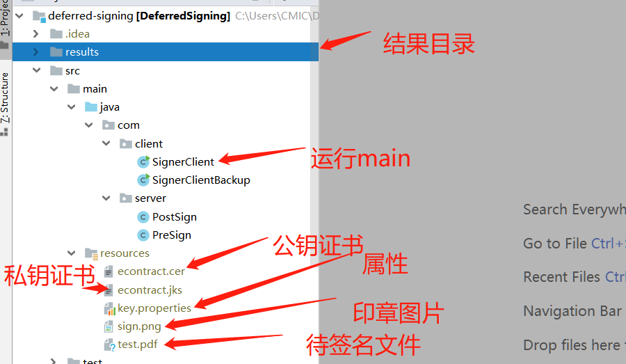

# pdf 分离式签名demo

SignerClient main方法可以执行具体流程

分离式签署步骤
1.get hash to be signed from PDF file

2.sign hash with private key

3.post signed hash to get the signed PDF

注意:

项目公钥证书,私钥证书,印章图片,待签名文件,属性配置文件,请自己准备.

